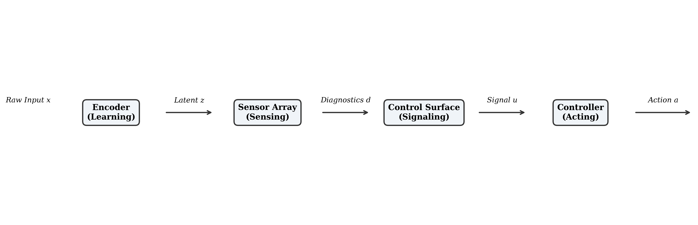

# Reliability Is a System Property: The Representation-Level Control Surfaces (RLCS) Paradigm

**Author**: Md Arshad, Department of Computer Science, Jamia Millia Islamia, 
**Date**: January 12, 2026  
**Repository**: [https://github.com/Sulkysubject37/resLik](https://github.com/Sulkysubject37/resLik)

---

## Abstract

Deep learning models deployed in open-world environments frequently encounter inputs that violate their training assumptions, leading to silent failures, overconfident predictions, and catastrophic system instability. Current mitigation strategies primarily treat reliability as a property to be *learned* by the model—through robust training, domain adaptation, or epistemic uncertainty estimation. We argue that this assumption is structurally flawed for safety-critical and high-throughput systems. Reliability is not an emergent property of learning, but a managed property of systems. We formally introduce **Representation-Level Control Surfaces (RLCS)**, a systems architecture that embeds lightweight, deterministic reliability sensing directly into the latent feature spaces of learned models. RLCS enforces a strict separation between *sensing* (measuring consistency), *signaling* (mapping measures to recommendations), and *acting* (executing decisions), preventing the conflation of statistical inference with execution policy. We present **resLik** (Residual Likelihood Sensor), the reference instantiation of the RLCS sensing layer, alongside companion sensors for temporal and cross-view consistency. Through multi-domain demonstrations in robotics, applied AI, and data systems, we show that RLCS enables the construction of "self-aware" pipelines that can deterministically detect distribution shifts, temporal shocks, and modal conflicts without requiring model retraining, complex ensemble fusion, or prohibitive computational overhead.

---

## 1. Introduction

### 1.1 The Reliability Assumption in Modern Systems
The widespread deployment of deep learning models in perception, decision-making, and data-driven pipelines rests on an implicit but consequential assumption: that a model’s output confidence is a reliable proxy for its correctness. In closed-world settings—where the test distribution P_{\text{test}}(X) closely matches the training distribution P_{\text{train}}(X)—this assumption is often justified. Modern neural architectures, including deep convolutional networks and large transformers, can achieve high accuracy and acceptable calibration under such conditions.

In open-world and safety-critical deployments, however, this assumption breaks down. Real systems routinely encounter inputs that violate training assumptions: environmental changes, sensor degradation, adversarial corruption, or semantic novelty. When latent representations drift away from the learned manifold, neural networks do not reliably signal failure. Instead, they frequently extrapolate with high confidence on semantically invalid inputs, leading to silent failures (Hendrycks & Gimpel, 2017).

This failure mode exposes a structural gap in modern system design. While controllers and downstream logic consume model outputs to make consequential decisions, they typically lack independent observability into whether the model’s internal representation remains valid. As a result, systems are forced to conflate model confidence with system reliability, even though these notions are not equivalent.

Key observation: Silent failure is not primarily a learning problem—it is an observability problem at the system level.

### 1.2 Why Learning Alone Cannot Guarantee Reliability
The dominant response to reliability failures has been to modify the learning process itself. Bayesian neural networks (Gal & Ghahramani, 2016), deep ensembles (Lakshminarayanan et al., 2017), adversarial training (Madry et al., 2018), and calibration techniques aim to encode uncertainty awareness directly into model parameters. While theoretically grounded and empirically effective in controlled benchmarks, these approaches face structural limitations when deployed in real systems.

First, many uncertainty-aware methods impose substantial computational overhead. Monte Carlo sampling, ensemble inference, or auxiliary networks often increase inference cost by an order of magnitude, making them impractical for high-frequency control loops or high-throughput data systems.

Second, and more fundamentally, these approaches conflate learning with sensing. Reliability becomes an implicit side effect of optimization rather than an explicit, observable signal. When failure occurs, the system cannot distinguish why—whether due to sensor corruption, distributional shift, temporal instability, or modal disagreement. All failure modes collapse into a single probability score, obscuring actionable diagnostics.

From a systems engineering perspective, this is a design flaw. Physical control systems do not rely on actuators to self-diagnose correctness; they employ independent sensors to monitor speed, torque, temperature, and drift. Neural systems lack an analogous layer of independent observability over their latent state.

Reliability cannot be guaranteed by learning alone, because learning does not provide explicit visibility into representation validity at runtime.

### 1.3 Reliability as a System Property
This paper advances a simple but structural thesis:

Reliability is not a property learned by models, but a property sensed and managed by systems.

Under this view, reliability must be externalized from the learning objective and treated as a first-class system signal. Rather than asking models to self-assess their trustworthiness, systems should independently sense whether latent representations remain consistent with known reference frames, and manage execution accordingly.

We operationalize this thesis through the Representation-Level Control Surfaces (RLCS) paradigm. RLCS introduces an explicit reliability-sensing layer between representation learning and downstream execution. This layer observes latent representations directly, emits interpretable diagnostic signals, and enables deterministic control responses without embedding policy logic into the model itself.

### 1.4 Contributions 
This work makes the following contributions:
	1.	RLCS Paradigm
We formalize Representation-Level Control Surfaces as a systems architecture that strictly separates reliability sensing, control signaling, and execution acting.
	2.	Sensor Taxonomy
We define a taxonomy of representation-level reliability sensors—Population-Level, Temporal, and Cross-View—each targeting an orthogonal failure mode.
	3.	Reference Instantiations
We present resLik (a population-level likelihood-consistency sensor), the Temporal Consistency Sensor (TCS), and an Agreement Sensor, each implemented as forward-only, linear-time operations.
	4.	Composition Rules
We articulate principled rules for composing multiple reliability sensors without fusion, voting, or arbitration.
	5.	Multi-System Demonstrations
We demonstrate RLCS behavior across applied AI pipelines, robotics perception systems, and high-throughput data ingestion workflows.

### 1.5 Paper Organization 
The remainder of this paper is structured as follows. Section 2 formalizes the notion of reliability and outlines system-level design requirements. Section 3 introduces the RLCS architecture and compliance criteria. Section 4 presents the RLCS sensor taxonomy, followed by mathematical formulations in Section 5. Section 6 describes the control surface design, and Section 7 details sensor composition rules. Section 8 demonstrates RLCS behavior across multiple system domains. Limitations and failure modes are discussed in Section 9, followed by related work in Section 10. We conclude with broader implications and future directions in Sections 11 and 12.

---

## 2. Problem Formulation and Design Goals
This section formalizes what is meant by reliability in the RLCS paradigm and derives the system-level constraints that any representation-level reliability mechanism must satisfy. We also explicitly delineate the boundaries of the paradigm to prevent misinterpretation.

### 2.1 What Reliability Is (and Is Not)
In the context of RLCS, reliability is defined as the statistical consistency of a latent representation with respect to a validated reference frame. The reference frame may correspond to a global training population, a local temporal history, or an independent peer representation.

Crucially, reliability in this sense is a property of representation validity, not task performance. To avoid conceptual overlap with existing terminology, we distinguish this definition from several related but non-equivalent concepts:

• Reliability ≠ Accuracy
A model may operate on a representation that is statistically consistent with its training distribution and still produce an incorrect output due to class ambiguity, label noise, or task complexity. RLCS validates the appropriateness of the input evidence, not the correctness of the prediction. It guarantees that the system is asking a valid question, not that it will produce the correct answer.

• Reliability ≠ Uncertainty
Uncertainty typically refers to probabilistic measures over model outputs, encompassing epistemic and aleatoric components. RLCS does not attempt to estimate uncertainty in this sense. Instead, it deterministically measures deviations in latent space relative to explicit reference statistics. As a result, RLCS produces interpretable diagnostics rather than probabilistic beliefs.

• Reliability ≠ Calibration
Calibration concerns the alignment between predicted probabilities and empirical outcome frequencies (e.g., a prediction of 0.7 being correct 70% of the time). RLCS operates prior to output generation and does not depend on labeled outcomes. It evaluates whether the internal representation itself lies within a regime where calibrated predictions are even meaningful.

By construction, RLCS treats reliability as an observability problem: can the system determine, at runtime, whether its internal state remains within a validated operating envelope?

### 2.2 System-Level Requirements
For representation-level reliability sensing to function as a control surface in real systems, it must satisfy a set of engineering constraints that are often secondary in purely algorithmic research but dominant in production environments.

1. Observability
The mechanism must expose why a representation is deemed unreliable. Distinct failure modes—such as abrupt temporal discontinuities versus gradual distributional drift—must be separable, as they imply different downstream responses.

2. Interpretability
Reliability signals must be discrete and semantically meaningful (e.g., PROCEED, DOWNWEIGHT, DEFER, ABSTAIN). Continuous scores alone are insufficient for deterministic system logic, safety audits, and post hoc analysis.

3. Composability
Reliability mechanisms must be modular. Introducing an additional sensor (e.g., temporal coherence) should not require retraining the encoder, modifying existing sensors, or restructuring the pipeline. Each sensor must operate independently.

4. Determinism
Given fixed inputs and fixed parameters, the sensing and signaling process must be deterministic. Stochastic sampling, randomized inference, or non-reproducible behavior is incompatible with safety interlocks and audit requirements.

5. Runtime Efficiency
The computational cost of reliability sensing must be negligible relative to representation extraction. RLCS sensors are therefore constrained to operations linear in the representation dimension (O(d)), avoiding covariance estimation or quadratic interactions that scale poorly in high-dimensional latent spaces.

Together, these requirements imply that reliability sensing must be **cheap, explicit, and externally controllable**, rather than statistically optimal in isolation. 

### 2.3 Explicit Non-Goals
To preserve architectural clarity and avoid scope creep, RLCS explicitly excludes the following objectives:

• End-to-End Learning
The sensing layer is not optimized via backpropagation during deployment. RLCS sensors are fixed functions whose parameters are configured offline. This design choice ensures predictability and decouples sensing from task optimization.

• Automatic Correction or Reconstruction
RLCS detects unreliable representations but does not attempt to repair, denoise, or hallucinate corrected inputs. Automatic correction conflates sensing with acting and introduces unobservable failure modes.

• Controller or Policy Design
RLCS does not prescribe how a system should respond to reliability signals. Control policies—such as braking, rerouting, deferring to a human operator, or triggering retraining—remain entirely external to the paradigm.

These exclusions are not limitations but deliberate design decisions. RLCS is concerned with making reliability visible, not with resolving uncertainty or optimizing behavior.

---

## 3. Representation-Level Control Surfaces (RLCS)
This section formalizes Representation-Level Control Surfaces (RLCS) as a systems architecture. We define its components, information flow, and compliance criteria, and distinguish it structurally from adjacent paradigms.

### 3.1 Architectural Overview
RLCS introduces an explicit reliability observability layer between representation learning and execution. The architecture enforces a unidirectional flow of information and a strict separation of concerns.

We model an RLCS-compliant system as a tuple:

(\mathcal{E}, \mathcal{S}, \Pi, \mathcal{C})

with the following functional composition:
x \xrightarrow{\mathcal{E}} z \xrightarrow{\mathcal{S}} d \xrightarrow{\Pi} u \xrightarrow{\mathcal{C}} a

where:
1.  **The Encoder ($\mathcal{E}: \mathcal{X} \to \mathbb{R}^d$)**: Maps raw input $x$ to a latent representation $z$. The encoder is treated as a "state estimator" that is frozen or updated independently.
2.  **The Sensor Array ($\mathcal{S}: \mathbb{R}^d \to \mathbb{R}^k$)**: A set of independent functions that measure the consistency of $z$ against various reference frames (population, history, peers). It outputs raw diagnostics $d$.
3.  **The Control Surface ($\Pi: \mathbb{R}^k \to \mathbb{U}$)**: A stateless, deterministic logic layer that maps diagnostics $d$ to a formal control signal $u \in \mathbb{U}$ (e.g., `PROCEED`, `DEFER`, `ABSTAIN`).
4.  **The Controller ($\mathcal{C}: \mathbb{U} \times \mathcal{K} \to \mathcal{A}$)**: The external system logic that consumes $u$ alongside system context $k \in \mathcal{K}$ to execute action $a \in \mathcal{A}$.

### 3.2 RLCS Compliance Criteria  
The sensor array \mathcal{S} consists of a set of independent functions:
\mathcal{S} = \{ s_1, s_2, \dots, s_k \}, \quad s_i: \mathbb{R}^d \rightarrow \mathbb{R}

Each sensor observes the same latent representation z, but evaluates it against a distinct reference frame:
• population statistics,
• temporal history,
• peer representations.

The output of the sensor array is a diagnostic vector:
d = \mathcal{S}(z) = \big[ s_1(z), s_2(z), \dots, s_k(z) \big]

Key properties of RLCS sensors:
• Forward-only: no gradients are required or propagated.
• Linear-time: each s_i operates in O(d).
• Semantically interpretable: each diagnostic corresponds to a specific failure mode.
• Orthogonal by construction: sensors do not modify or condition each other.

Importantly, sensors do not alter the representation z.
They observe; **they do not intervene**.

### 3.3 Control Surface: From Diagnostics to Signals 
The control surface \Pi is a deterministic mapping from diagnostics to a finite signal set:

\Pi: \mathbb{R}^k \rightarrow \mathcal{U}

where:
\mathcal{U} = \{ \texttt{PROCEED}, \texttt{DOWNWEIGHT}, \texttt{DEFER}, \texttt{ABSTAIN} \}

Unlike probabilistic thresholds or learned policies, \Pi is explicitly rule-based. A typical instantiation takes the form:
u =
\begin{cases}
\texttt{ABSTAIN}, & \exists i : s_i(z) > \tau_i^{\text{hard}} \\
\texttt{DEFER}, & \exists i : s_i(z) > \tau_i^{\text{soft}} \\
\texttt{DOWNWEIGHT}, & \text{marginal violations} \\
\texttt{PROCEED}, & \text{otherwise}
\end{cases}

where:
 \tau_i^{\text{hard}} and \tau_i^{\text{soft}} are sensor-specific thresholds.

This mapping ensures:
• reproducibility,
• auditability,
• explicit risk tolerance configuration.

The control surface does not arbitrate truth between sensors; it encodes conservative system policy.

### 3.4 External Controller and Responsibility Boundary 
The external controller \mathcal{C} consumes the control signal u alongside system context k \in \mathcal{K} to execute an action:

a = \mathcal{C}(u, k)

Examples include:
• braking or slowing a robot,
• routing data to a fallback model,
• deferring to human review,
• tagging samples for retraining.

RLCS deliberately excludes \mathcal{C} from its scope.
This boundary enforces clear responsibility separation:
• RLCS answers: “Is this representation reliable?”
• The controller answers: “What should we do about it?”

### 3.5 RLCS Compliance Criteria 
A system is considered RLCS-compliant if it satisfies the following invariants:

1. Passive Sensing
Sensors observe representations but do not modify them for downstream tasks.

2. Non-Executive Operation
No sensor or control surface component executes side effects.

3. Bounded State
Sensors may retain minimal bounded state (e.g., z_{t-1}) but no adaptive memory.

4. No Arbitration or Fusion
Sensor outputs are not averaged, voted on, or fused into a single scalar.

5. Deterministic Semantics
Identical inputs produce identical diagnostics and signals.

Violating any of these conditions collapses RLCS into either a learning algorithm or a controller, breaking the paradigm.

### 3.6 Distinction from Related Architectures
RLCS is structurally distinct from several adjacent approaches:
• Ensemble Learning
Ensembles aggregate predictions to improve accuracy. RLCS does not aggregate predictions; it observes representation validity.
• Uncertainty Estimation
Probabilistic uncertainty quantifies belief over outputs. RLCS emits deterministic diagnostics tied to explicit reference frames.
• Runtime Monitoring
Traditional monitors log alerts asynchronously. RLCS sits on the execution path and gates system behavior in real time.
• Control Policies
RLCS does not decide actions. It provides evidence to systems that do.

These distinctions are architectural, not merely implementation choices. The mathematical instantiations of these sensors are defined in Section 5.

---

## 4. RLCS Sensor Taxonomy

Reliability at the representation level is inherently multi-dimensional. No single diagnostic can distinguish all failure modes encountered in open-world systems. RLCS therefore formalizes sensors as first-class, independent observers of latent representations, each defined by the reference frame against which consistency is evaluated.

This section introduces a taxonomy of RLCS sensors based on their reference frame and the class of failure modes they detect.

### 4.1 Sensor as First Class Observers 
An RLCS sensor is a deterministic function

s: \mathbb{R}^d \rightarrow \mathbb{R}

that evaluates a latent representation z against a specific reference frame. The defining property of an RLCS sensor is not its mathematical form, but its epistemic role: each sensor answers a different question about representation validity.

Crucially:
• Sensors do not predict labels.
• Sensors do not estimate correctness.
• Sensors do not modify representations.

They answer only:
Is this representation consistent with respect to a particular notion of validity?

Different notions of validity correspond to different reference frames.

### 4.2 Taxonomy by Reference Frame 
We formalize three classes of RLCS sensors, each targeting an orthogonal failure mode. Together, they span the dominant sources of representation unreliability in deployed systems.
**table : Sensor Class
Reference Frame
Primary Failure Mode
Representative Sensor
Population-Level Consistency
Global training distribution
Out-of-distribution inputs, novelty
ResLik
Temporal Consistency
Local state history (t-1)
Shocks, glitches, instability
TCS
Cross-View Consistency
Peer representation
Modal conflict, partial sensor failure
Agreement** {to be edited}

Each class is defined by what it compares against, not by the specific metric used.

![Figure 2: RLCS sensor taxonomy. Each sensor observes the same latent representation but evaluates it against a different reference frame: global population statistics, local temporal history, or an independent peer representation. Orthogonality arises from the reference frame, not from the implementation] (figures/fig2_reslik_response.png)

### 4.3 Population Level Consistency Sensors
Population-level sensors evaluate whether a representation is statistically consistent with a validated reference population, typically derived from training data.

Definition
Let \mathcal{P} denote a reference population in latent space, summarized by fixed statistics. A population-level sensor evaluates the deviation of z from \mathcal{P}.

Failure Modes Detected
• Out-of-distribution inputs
• Semantic novelty
• Adversarial or corrupted samples

Representative Instantiation: ResLik
The Residual Likelihood Sensor (ResLik) measures normalized deviation of z from population statistics. It answers the question:

Does this representation plausibly belong to the same distribution as the training data?

Blind Spot
Population-level sensors cannot distinguish valid novelty (e.g., concept drift) from invalid corruption. Both appear as deviation from the reference distribution. 

### 4.4 Temporal Consistency Sensors
Temporal sensors evaluate whether a representation evolves coherently over time.

Definition
Let z_t and z_{t-1} denote successive latent representations. A temporal sensor measures the magnitude and structure of change between them, normalized to ensure scale invariance.

Failure Modes Detected
• Sudden shocks or glitches
• Sensor dropouts
• Physically implausible state transitions

Representative Instantiation: TCS
The Temporal Consistency Sensor (TCS) evaluates short-horizon self-consistency. It answers the question:

Is the system changing faster or more abruptly than expected?

Blind Spot
Temporal sensors are insensitive to slow, monotonic drift. A representation can remain temporally smooth while gradually departing from the valid population manifold.

### 4.5 Cross View Consistency Sensors
Cross-view sensors evaluate agreement between independent representations of the same underlying input.

Definition
Let z^{(1)} and z^{(2)} denote representations derived from distinct modalities, models, or pipelines. A cross-view sensor measures their geometric or semantic alignment.

Failure Modes Detected
• Modal disagreement
• Partial sensor failure
• Ambiguous or conflicting evidence

Representative Instantiation: Agreement Sensor
The Agreement Sensor measures alignment (e.g., cosine similarity) between peer representations. It answers the question:

Do independent observers agree on the state of the world?

Blind Spot
Cross-view sensors cannot detect common-mode failures, where multiple sensors fail in the same correlated manner.

### 4.6 Orthogonality and Complementarity 
The strength of the RLCS sensor taxonomy lies in orthogonality by reference frame:
• Population-level sensors compare against what was seen before.
• Temporal sensors compare against what just happened.
• Cross-view sensors compare against what another observer sees.

Because each sensor encodes a distinct notion of validity, their signals are complementary rather than redundant. This orthogonality enables conservative, interpretable system behavior when sensors are composed, without resorting to fusion or arbitration.

The rules governing such composition are formalized in Section 7.

---

## 5. Mathematical Formulation

This section presents the mathematical formulation of the RLCS sensor family. All sensors are designed as forward-only, deterministic functions over latent representations, with bounded computational cost and interpretable semantics. The emphasis is not on probabilistic optimality, but on structural reliability observability.

Throughout, let z \in \mathbb{R}^d denote a latent representation produced by a fixed encoder.

### 5.1 Shared Design Properties 
All RLCS sensors satisfy the following mathematical constraints:
1. Forward-Only Evaluation
Each sensor is a fixed function s: \mathbb{R}^d \rightarrow \mathbb{R} evaluated at inference time. No gradients, sampling, or optimization are involved.

2. Monotonicity
Sensor outputs are monotonic with respect to the magnitude of deviation from their reference frame. Larger deviations produce larger discrepancy scores or lower consistency scores.

3. Scale Awareness
Sensors normalize raw deviations to avoid coupling diagnostic magnitude to the absolute scale of the representation.

4. Linear-Time Complexity
All operations scale linearly with representation dimension d, ensuring negligible overhead relative to encoding.

These properties ensure that sensors are predictable, composable, and suitable for real-time systems.

### 5.2 Population Level Consistency: ResLik
The Residual Likelihood Sensor (ResLik) measures deviation from a reference population defined by frozen statistics.

Let \mu, \sigma \in \mathbb{R}^d denote the mean and standard deviation of latent representations computed over a validated reference dataset. Given an input representation z, ResLik computes a normalized residual:

\tilde{z}_i = \frac{z_i - \mu_i}{\sigma_i + \epsilon}, \quad i = 1, \dots, d

The population discrepancy score is defined as the mean absolute normalized deviation:

D_{\text{pop}}(z) = \frac{1}{d} \sum_{i=1}^{d} \left| \tilde{z}_i \right|

This scalar summarizes how atypical the representation is relative to the reference population.

To map discrepancy to a bounded consistency signal, ResLik applies an exponential gating function with sensitivity parameter \lambda > 0 and dead-zone threshold \tau \geq 0:

g_{\text{pop}}(z) = \exp\!\left(-\lambda \cdot \max(0, D_{\text{pop}}(z) - \tau)\right)

The dead-zone ensures that small, benign deviations do not trigger attenuation. As D_{\text{pop}} increases, g_{\text{pop}} decays monotonically toward zero.

Properties:
	•	D_{\text{pop}} = 0 implies perfect population consistency.
	•	Sensitivity to outliers is controlled explicitly via \lambda.
	•	Computational complexity is O(d).

### 5.3 Temporal Consistency: TCS
The Temporal Consistency Sensor (TCS) evaluates short-horizon self-consistency by comparing successive representations.

Let z_t and z_{t-1} denote the current and immediately preceding representations. The raw temporal deviation is:

\Delta_t = \| z_t - z_{t-1} \|_2

To ensure scale invariance, this deviation is normalized by the magnitude of the prior state:

D_{\text{time}}(z_t) = \frac{\Delta_t}{\| z_{t-1} \|_2 + \epsilon}

The normalized drift score is mapped to a consistency signal:

g_{\text{time}}(z_t) = \exp\!\left(-\alpha \cdot D_{\text{time}}(z_t)\right)

where \alpha > 0 controls sensitivity to abrupt changes.

Properties:
• Smooth evolution yields g_{\text{time}} \approx 1.
• Sudden shocks produce rapid decay toward zero.
• Requires only bounded state (z_{t-1}).
• Computational complexity is O(d).

### 5.4 Cross View Consistency: Agreement Sensor 
The Agreement Sensor evaluates consistency between two independent representations of the same input.

Let z^{(1)}, z^{(2)} \in \mathbb{R}^d denote peer representations. Agreement is measured via cosine similarity:

A(z^{(1)}, z^{(2)}) =
\frac{ z^{(1)} \cdot z^{(2)} }
{ \| z^{(1)} \|_2 \, \| z^{(2)} \|_2 + \epsilon }

This yields a bounded score A \in [-1, 1], where higher values indicate stronger alignment.

We define the disagreement metric as:

D_{\text{agree}} = 1 - A

which maps perfect agreement to zero and increasing misalignment to larger values.

Properties:
• Invariant to representation magnitude.
• Symmetric with respect to input ordering.
• Detects modal conflict and partial sensor failure.
• Computational complexity is O(d).

### 5.5 Unified Diagnostic Vector
For a system employing all three sensors, the diagnostic output takes the form:

d(z) = \big[
D_{\text{pop}}(z),\;
D_{\text{time}}(z_t),\;
D_{\text{agree}}(z^{(1)}, z^{(2)})
\big]

Each component corresponds to a distinct notion of validity and must be interpreted independently. RLCS explicitly forbids collapsing this vector into a single scalar score.

The diagnostic vector is consumed by the control surface, described in Section 6.

---

## 6. Control Surface Design

### 6.1 From Diagnostics to Control Signals
The control surface \Pi is defined as a deterministic mapping:

\Pi : \mathbb{R}^k \rightarrow \mathcal{U}

where \mathcal{U} is a finite, semantically interpretable signal set.

Given a diagnostic vector
d(z) = [D_{\text{pop}}, D_{\text{time}}, D_{\text{agree}}],

the role of \Pi is to compress continuous, high-dimensional evidence into a discrete control recommendation that can be consumed by external system logic.

We define the canonical RLCS signal set as:
• **PROCEED**
All diagnostics lie within nominal bounds. The representation is considered valid for normal automated processing.

• **DOWNWEIGHT**
Diagnostics indicate marginal inconsistency. The representation may be usable, but its influence should be reduced in downstream aggregation, fusion, or ranking.

• **DEFER**
Reliability is insufficient for autonomous execution. The representation should be routed to a fallback mechanism (e.g., human review, conservative controller, secondary model).

• **ABSTAIN**
One or more diagnostics indicate a hard violation (e.g., shock, corruption, or severe inconsistency). The representation is invalid and should be discarded to protect system state.

These signals are **recommendations**, not commands. Their semantics are intentionally abstract, allowing different systems to map them to context-appropriate actions.

### 6.2 Deterministic Logic and Thresholding 
The defining property of the control surface is **determinism**. For fixed diagnostics and fixed parameters, the emitted signal must be invariant.

A typical control surface instantiation is expressed as a monotonic rule set:

\Pi(d) =
\begin{cases}
\texttt{ABSTAIN}, & \exists i : d_i > \tau_i^{\text{hard}} \\
\texttt{DEFER}, & \exists i : d_i > \tau_i^{\text{soft}} \\
\texttt{DOWNWEIGHT}, & \text{marginal violations} \\
\texttt{PROCEED}, & \text{otherwise}
\end{cases}

where \tau_i^{\text{hard}} and \tau_i^{\text{soft}} are sensor-specific thresholds.

Key properties of this mapping:
	•	Monotonicity: Increasing inconsistency cannot produce a less conservative signal.
	•	Explicit Risk Encoding: Thresholds encode system risk tolerance directly, rather than implicitly via model retraining.
	•	Reproducibility: Identical diagnostics always yield identical signals.

Unlike probabilistic confidence thresholds, these parameters are system configuration values, not learned quantities.

### 6.3 Auditability and Responsibilty Separation
Because the control surface is deterministic and rule-based, it provides a transparent audit trail:
• which sensor triggered a signal,
• which threshold was crossed,
• and why a particular recommendation was emitted.

This transparency is critical in regulated or safety-critical environments, where post-incident analysis must distinguish between sensing failure, policy choice, and execution error.

Equally important is what the control surface does not do:
• It does not arbitrate between sensors.
• It does not estimate correctness.
• It does not optimize behavior.
• It does not execute actions.

Responsibility is explicitly partitioned:
• RLCS answers: “Is this representation reliable?”
• The controller answers: “What should be done given that assessment?”

This separation prevents hidden policy decisions from being embedded inside statistical models.

### 6.4 Control Surface vs. Controllers 
Although the control surface emits signals that influence behavior, it is not a controller in the control-theoretic sense. Controllers map state to actions; control surfaces map diagnostics to recommendations.

This distinction is deliberate. By keeping control logic external, RLCS ensures that:
• reliability sensing remains general and reusable,
• system-specific policies remain configurable,
• and failures remain attributable.

The control surface thus functions as a semantic interface between representation reliability and system execution. Demonstrations of this signaling logic are provided in Section 8.

---

## 7. Sensor Composition Rules

A central contribution of RLCS is the formalization of how multiple reliability sensors coexist within a single system. In contrast to ensemble methods or multi-model fusion, RLCS treats sensors as parallel observers of representation validity rather than as competing predictors.

This section defines the composition rules that preserve interpretability, prevent collapse into opaque fusion logic, and maintain clear responsibility boundaries.

### 7.1 The Independence Invariant
RLCS enforces an independence invariant:

Sensors are parallel observers, not competing predictors.

Formally, given a sensor array
\mathcal{S} = \{s_1, s_2, \dots, s_k\},

each sensor s_i evaluates the same latent representation z against a distinct reference frame and produces an independent diagnostic d_i = s_i(z).

The invariant requires that:
• No sensor conditions its output on another sensor’s output.
• No sensor modifies the representation based on another sensor.
• No sensor attempts to “correct” or override another sensor.

For example:
• ResLik does not adapt its population statistics based on temporal stability.
• TCS does not suppress its signal because population consistency is high.
• Agreement does not discount conflict because one modality appears nominal.

Each sensor contributes an orthogonal slice of validity evidence, and orthogonality is defined by reference frame, not by implementation details.

### 7.2 The Non-Arbitration Rule
The Control Surface must not arbitrate "truth" between sensors (e.g., "ResLik is probably right, so ignore TCS"). Instead, it applies a conservative logic: **ambiguity is a signal in itself.**

**Valid Composition (The Conservative OR):**
$ \text{State} = \begin{cases} 
\text{UNRELIABLE} & \text{if } \exists s \in \mathcal{S} : s(z) \text{ reports FAILURE} \\
\text{RELIABLE} & \text{otherwise}
\end{cases} $

### 7.3 Anti-Patterns
*   **Fusion**: $z_{final} = w_1 z_1 + w_2 z_2$. This destroys the specific evidence of conflict.
*   **Smoothing**: Applying Kalman filters *inside* the sensor. This hides volatility from the controller. Smoothing is an actuator function, not a sensor function.
*   **Majority Voting**: Ignoring a sensor because it is the minority outlier. In safety systems, the outlier is often the only one seeing the crash.

## 8. Multi-System Demonstrations

We validated the RLCS paradigm by implementing reference controllers across three distinct domains using the `resLik` library.

### 8.1 Applied AI Pipelines
We first consider an applied AI pipeline resembling a Retrieval-Augmented Generation (RAG) or multi-stage inference system, where downstream components implicitly assume that upstream embeddings are semantically valid.

**Scenario**
The system processes a stream of text embeddings under three conditions:
1. nominal in-distribution inputs,
2. gradual domain shift (valid but novel content),
3. abrupt corruption via random noise vectors.

**Observed Sensor Behavior**
• **ResLik** reports increasing population discrepancy under gradual domain shift, reflecting deviation from the reference distribution.
• **TCS** remains nominal during gradual drift but reports a sharp failure under sudden noise injection.
• **Agreement** is not engaged in this single-view setting.

**Control Surface Outcome**
• Gradual drift produces a DOWNWEIGHT signal, indicating usable but degraded reliability.
• Abrupt corruption produces ABSTAIN, invalidating the representation.

**Interpretation**
RLCS distinguishes valid novelty from invalid corruption without relying on task labels or output probabilities. Standard uncertainty estimates typically conflate these cases, producing high uncertainty in both scenarios without exposing the underlying cause.

### 8.2 Robotics Perception System 
We next evaluate RLCS in a simulated robotics perception stack with redundant sensing, using Lidar and camera-based encoders.

**Scenario**
Under nominal conditions, both modalities produce consistent representations. A simulated “sensor blinding” event (e.g., heavy rain) degrades the Lidar signal while leaving the camera stream intact.

**Observed Sensor Behavior**
• **Agreement Sensor** detects divergence between Lidar and camera representations, with alignment decreasing sharply.
• **ResLik** reports the Lidar representation as out-of-distribution, while the camera remains nominal.
• **TCS** reports temporal stability, indicating that the failure is not a transient glitch.

**Control Surface Outcome**
The control surface emits a DEFER signal for the Lidar stream while allowing continued processing of the camera stream.

**Interpretation**
RLCS isolates modal conflict from temporal instability and population-level novelty. Rather than fusing or averaging inconsistent signals, the system surfaces disagreement explicitly, enabling the external controller to switch sensing strategies without suppressing evidence.

### 8.3 Data Systems and Streaming Pipelines
Finally, we consider a high-throughput data ingestion system where reliability failures propagate downstream if not detected early.

**Scenario**
The system processes a continuous data stream under two conditions:
1. gradual concept drift (valid evolution),
2. abrupt corruption via bit-flip noise.

**Observed Sensor Behavior**
• **ResLik** reports deviation under both drift and corruption.
• **TCS** remains nominal during gradual drift but fails sharply under corruption.
• **Agreement** is not required in this single-source setting.

**Control Surface Outcome**
• Gradual drift triggers a PROCEED_WITH_TAG or equivalent DOWNWEIGHT signal, marking data for later analysis or retraining.
• Corruption triggers ABSTAIN, causing the batch to be dropped.

**Interpretation**
RLCS separates distributional change from data integrity failure, enabling automated data hygiene without conflating the two. This distinction is difficult to achieve using aggregate statistics or downstream validation alone.

### 8.4 Summary of Demonstrated Behavior
Across all domains, RLCS exhibits three consistent properties:
1. **Failure-Mode Separation**
Different sensors respond to different classes of failure, producing interpretable diagnostics.

2. **Architectural Generality**
The same sensor definitions and control surface logic apply across AI pipelines, robotics, and data systems.

3. **Non-Intrusive Integration**
Reliability sensing is added without modifying encoders, retraining models, or embedding policy logic into learning components.

These demonstrations support the central claim of this work: reliability can be made explicit, interpretable, and actionable at the system level without entangling it with model optimization.

---

## 9. Limitations and Failure Modes
RLCS improves the observability of reliability at the representation level, but it does not eliminate uncertainty or failure. The paradigm is intentionally constrained, and its limitations follow directly from its design principles.

### 9.1 Dependence on Reference Quality 
Population-level sensors such as ResLik rely on fixed reference statistics (\mu, \sigma) derived from a validated dataset. If this reference set is poorly curated—containing systematic outliers, mislabeled data, or unrepresentative samples—the resulting diagnostics will be correspondingly degraded.

In such cases:
	•	population deviations may be underreported,
	•	novelty detection may become desensitized,
	•	and corruption may be misclassified as benign variation.

This limitation is structural rather than algorithmic: RLCS does not infer reference validity online. Reference construction and maintenance remain a system responsibility.

### 9.2 Forward-only Constraint
The current RLCS formulation is forward-only and non-differentiable. Sensors are evaluated strictly at inference time and do not participate in gradient-based optimization.

As a result:
• RLCS cannot directly regularize representation learning during training,
• reliability signals cannot be backpropagated into the encoder,
• and adaptation to new operating regimes requires external updates.

This constraint is deliberate. It preserves determinism, auditability, and separation of concerns. Differentiable variants are possible, but must preserve the same architectural invariants to remain RLCS-compliant.

### 9.3 Ambiguity is Exposed, Not Resolved 
When sensors emit conflicting diagnostics—e.g., strong population consistency alongside low cross-view agreement—RLCS does not attempt to resolve the conflict.

Instead:
• the conflict itself is surfaced as a reliability signal,
• the control surface emits a conservative recommendation,
• and resolution is delegated to the external controller.

This behavior is not a deficiency but a design choice. Attempting to arbitrate between sensors would embed hidden policy logic into the sensing layer, undermining interpretability and auditability.

### 9.4 Coverage is Not Exhaustive 
RLCS sensors are designed to detect classes of failure, not all possible failures. Certain conditions remain outside their scope, including:
	•	common-mode failures affecting all modalities identically,
	•	semantically incorrect but statistically consistent representations,
	•	adversarial manipulations that preserve latent statistics.

RLCS does not claim completeness. It provides structured observability, not guarantees of correctness.

### 9.5 Summary
RLCS makes reliability visible and actionable, but it does not:
	•	validate task correctness,
	•	replace robust training,
	•	or eliminate the need for system-level policy design.

Its role is diagnostic, not corrective.

**RLCS exposes reliability; it does not resolve ambiguity.**

By shifting uncertainty handling from implicit model behavior to explicit system logic, RLCS enables safer, more accountable deployment of learned components. These limitations motivate the system-level discussion in Section 11.

---

## 10. Related Work
RLCS intersects with several active research areas spanning machine learning, uncertainty estimation, and safety-critical systems. Rather than competing directly with these approaches, RLCS is best understood as an architectural complement that reframes reliability as a system-level observability problem.

### 10.1 Uncertainty Estimation and Model Confidence

A substantial body of work treats reliability as a form of uncertainty estimation learned by the model itself. Bayesian Neural Networks and approximate Bayesian methods such as Monte Carlo Dropout (Gal & Ghahramani, 2016) aim to capture epistemic uncertainty through stochastic inference. Similarly, Deep Ensembles (Lakshminarayanan et al., 2017) estimate predictive uncertainty by aggregating multiple independently trained models.

While effective in controlled settings, these approaches incur significant computational overhead at inference time and conflate uncertainty estimation with prediction. More importantly, they expose uncertainty only at the output layer, offering limited insight into why a model is uncertain or whether its internal representation is valid.

RLCS differs fundamentally in both scope and intent. It does not estimate probabilistic uncertainty, nor does it attempt to approximate Bayesian inference. Instead, it deterministically measures consistency of latent representations relative to explicit reference frames, prioritizing interpretability, auditability, and constant-time evaluation.

### 10.2 Out-of-Distribution (OOD) Detection
OOD detection has been extensively studied as a classification or scoring problem. Early baselines relied on softmax confidence (Hendrycks & Gimpel, 2017), while later approaches introduced input perturbations (ODIN; Liang et al., 2018) or distance-based methods using Mahalanobis statistics in feature space (Lee et al., 2018).

ResLik shares mathematical similarities with feature-space OOD detectors, particularly in its use of normalized deviations from reference statistics. However, the framing is deliberately different. Traditional OOD methods aim to answer the question “Is this input out-of-distribution?” as a binary or probabilistic classification task.

RLCS reframes this question as “Should the system act on this representation?” Population-level deviation is treated as **diagnostic evidence**, not a final decision. Moreover, RLCS explicitly supports multiple orthogonal sensors (temporal, cross-view), whereas most OOD methods operate in isolation.

### 10.3 Representation and Feature Space Analysis
Several works have explored monitoring internal representations for model introspection or failure detection. Influence functions, activation statistics, and layer-wise diagnostics have been proposed as tools for debugging and interpretability (Koh & Liang, 2017; Morcos et al., 2018).

These approaches are typically retrospective and analytic rather than operational. They are used offline to understand model behavior, not as real-time interlocks in deployed systems. RLCS differs by treating representation monitoring as a first-class runtime component, explicitly designed to sit on the execution path with bounded latency.

### 10.4 Runtime Monitoring and ML System Safety
In production ML systems, reliability is often handled through external monitoring infrastructure—dashboards, alerts, and logging pipelines (Breck et al., 2017). While essential, these mechanisms are typically asynchronous and do not gate execution directly.

RLCS occupies a different position: it provides inline observability. Sensors operate synchronously on representations and can influence system behavior before downstream components consume unreliable data.

This distinction aligns RLCS more closely with safety interlocks than with post-hoc monitoring.

### 10.5 Control-Theoretic Inspirations 
The architectural philosophy of RLCS draws inspiration from control theory, particularly **Simplex Architectures** for safety-critical systems (Sha, 2001). In such systems, a complex, high-performance controller is supervised by a simpler, verified safety controller that intervenes when operating assumptions are violated.

RLCS adopts a similar separation of concerns, but applies it to the latent space of learned models. Rather than overriding actions directly, RLCS supervises representations and emits control-relevant signals that external controllers can act upon.

Unlike classical control systems, however, RLCS does not require a formal plant model or stability guarantees. Its role is diagnostic rather than corrective.

### 10.6 Positioning Summary
RLCS is not:
• a replacement for uncertainty estimation,
• a new OOD detection algorithm,
• or a control policy.

Instead, it provides a systems architecture that unifies latent-space diagnostics, deterministic signaling, and external control. By explicitly separating sensing from acting, RLCS complements existing learning-centric approaches while addressing a gap that they do not target directly: runtime reliability observability.

---

## 11. Discussion and Outlook
The RLCS paradigm reframes reliability from a learned artifact of model training into an explicit, system-managed property. By treating latent representations as observable signals rather than opaque intermediates, RLCS shifts the focus of robustness from parameter tuning to architectural design. This shift aligns ML deployment more closely with established principles in systems and control engineering, where observability, separation of concerns, and determinism are foundational.

A key implication of RLCS is that graceful failure becomes a design choice rather than an emergent accident. Systems equipped with representation-level sensing can distinguish between different classes of invalidity—novelty, shock, conflict—and respond conservatively without requiring perfect predictions or calibrated probabilities. This capability is particularly relevant in open-world deployments, where distributional assumptions are routinely violated.

### 11.1 Differntiable Extensions
The current formulation of RLCS is intentionally forward-only. Sensors operate as fixed, deterministic functions evaluated at inference time. This design preserves auditability and prevents reliability logic from becoming entangled with task optimization.

A natural extension is **Differentiable RLCS**, in which sensor outputs contribute to the training objective:

\mathcal{L}_{\text{total}} = \mathcal{L}_{\text{task}} + \lambda \, \mathcal{L}_{\text{reliability}}.

Such an approach could encourage encoders to learn representations that are not only predictive, but also stable, consistent, and easier to monitor.

However, this extension raises important architectural questions. If sensing signals influence learning, care must be taken to preserve the core RLCS invariants—particularly the separation between sensing and acting. Reliability signals may guide representation formation, but they must not collapse into implicit control policies encoded in the model weights.

### 11.2 System Level Implications
Beyond individual models, RLCS suggests a broader perspective on ML system design. Reliability sensing can be:
• standardized across pipelines,
• reused across domains,
• and governed independently of model retraining cycles.

This opens the possibility of shared reliability infrastructure, where multiple models or modalities are supervised by a common control surface. In such systems, reliability becomes a first-class interface between learning components and operational policy.

### 11.3 Open Questions
Several open questions remain:
	•	How should reference statistics be maintained under long-term deployment and evolving data distributions?
	•	What are the trade-offs between sensitivity and false positives in different application domains?
	•	How can RLCS-style observability be extended to generative models and long-horizon decision processes?

These questions are inherently systems-oriented and may not admit purely algorithmic solutions. RLCS provides a framework within which they can be addressed explicitly rather than implicitly.

### 11.4 Perspective
RLCS does not aim to replace robust training, uncertainty estimation, or safety engineering. Instead, it complements them by making representation reliability observable, interpretable, and actionable at runtime.

The broader perspective is simple: as learning systems become larger and more complex, reliability must move out of the weights and into the architecture. RLCS represents one step toward that goal.

---

## 12. Conclusion

This work introduced **Representation-Level Control Surfaces (RLCS)**, a systems paradigm for making reliability observable at the level of latent representations. Rather than treating reliability as an emergent property of learning, RLCS externalizes it into explicit, deterministic sensing and signaling components that operate alongside learned models.

By defining a family of orthogonal sensors—population-level (ResLik), temporal (TCS), and cross-view (Agreement)—and formalizing their composition through a conservative control surface, we demonstrated how systems can detect and respond to distributional shift, instability, and modal conflict without retraining models or embedding policy logic into learned weights.

The central claim of this paper is simple: reliability is a system property. It must be measured, exposed, and managed through architecture, not inferred implicitly from model confidence. RLCS provides a concrete blueprint for doing so, enabling data-driven systems to fail gracefully, remain auditable, and operate safely in open-world conditions.

---

## References

Breck, E., Cai, S., Nielsen, E., Salib, M., & Sculley, D. (2017).
The ML test score: A rubric for ML production readiness.
In **Proceedings of the IEEE International Conference on Big Data**.

Gal, Y., & Ghahramani, Z. (2016).
Dropout as a Bayesian approximation: Representing model uncertainty in deep learning.
In **Proceedings of the 33rd International Conference on Machine Learning (ICML)**.

Hendrycks, D., & Gimpel, K. (2017).
A baseline for detecting misclassified and out-of-distribution examples in neural networks.
In **Proceedings of the International Conference on Learning Representations (ICLR)**.

Koh, P. W., & Liang, P. (2017).
Understanding black-box predictions via influence functions.
In **Proceedings of the 34th International Conference on Machine Learning (ICML)**.

Lakshminarayanan, B., Pritzel, A., & Blundell, C. (2017).
Simple and scalable predictive uncertainty estimation using deep ensembles.
In **Advances in Neural Information Processing Systems (NeurIPS)**.

Lee, K., Lee, H., Lee, K., & Shin, J. (2018).
A simple unified framework for detecting out-of-distribution samples and adversarial attacks.
In **Advances in Neural Information Processing Systems (NeurIPS)**.

Liang, S., Li, Y., & Srikant, R. (2018).
Enhancing the reliability of out-of-distribution image detection in neural networks.
In **Proceedings of the International Conference on Learning Representations (ICLR)**.

Madry, A., Makelov, A., Schmidt, L., Tsipras, D., & Vladu, A. (2018).
Towards deep learning models resistant to adversarial attacks.
In **Proceedings of the International Conference on Learning Representations (ICLR)**.

Morcos, A. S., Raghu, M., & Bengio, S. (2018).
Insights on representational similarity in neural networks.
In **Advances in Neural Information Processing Systems (NeurIPS)**.

Sha, L. (2001).
Using simplicity to control complexity.
**IEEE Software**, 18(4), 20–28.
